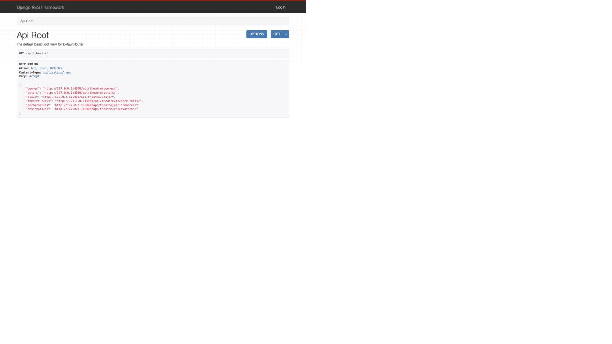
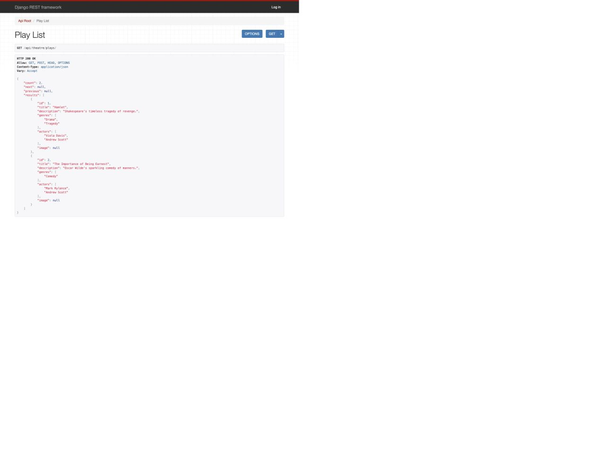
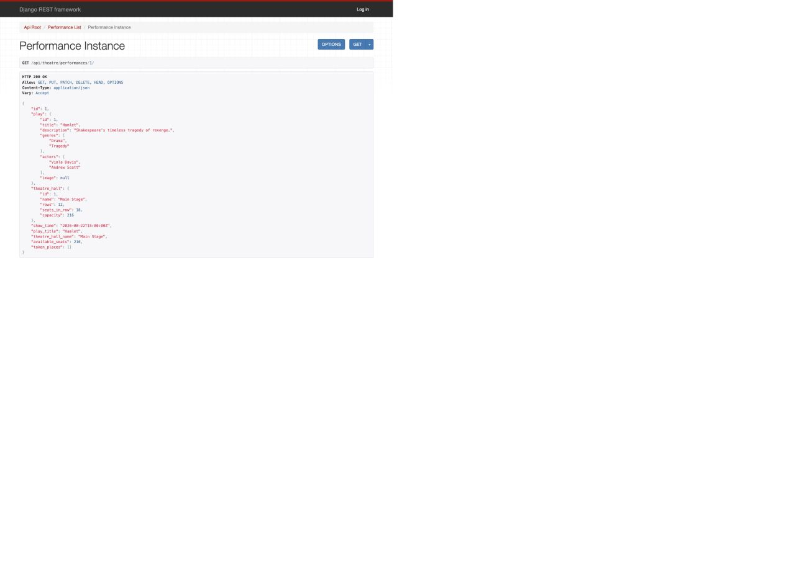

# Theatre API

API for a theatre: browse plays and performances, then reserve seats online.

## Features

- JWT authentication
- Plays, actors, genres and theatre halls
- Performance schedule and free-seat count
- Seat reservations with double-booking protection
- Admin panel, Swagger and Browsable API

## Run locally

```bash
git clone <repository-url>
cd <repository-directory>
python3 -m venv .venv
source .venv/bin/activate
pip install -r requirements.txt
cp .env.sample .env
python manage.py migrate
python manage.py seed_demo
python manage.py runserver
```

Open <http://127.0.0.1:8000/api/theatre/>.

## Run with Docker

Docker starts the API and PostgreSQL together, so you do not need to install
PostgreSQL manually.

```bash
docker compose up --build
docker compose exec api python manage.py seed_demo
```

Open <http://localhost:8000/api/theatre/>.

## Access

1. Register at `/api/user/register/`.
2. Get a JWT token at `/api/user/token/`.
3. Use `Bearer <access-token>` for reservations.

For an admin account, run:

```bash
python manage.py createsuperuser
```

Useful links:

- Swagger: <http://127.0.0.1:8000/api/doc/swagger/>
- Admin panel: <http://127.0.0.1:8000/admin/>
- Browsable API login: <http://127.0.0.1:8000/api-auth/login/>

## Screenshots







## Tests

```bash
python manage.py test
```
